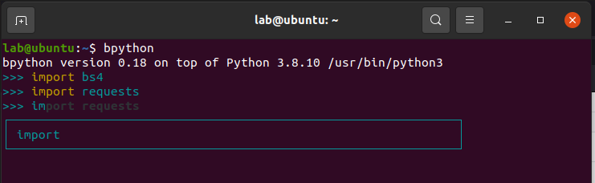
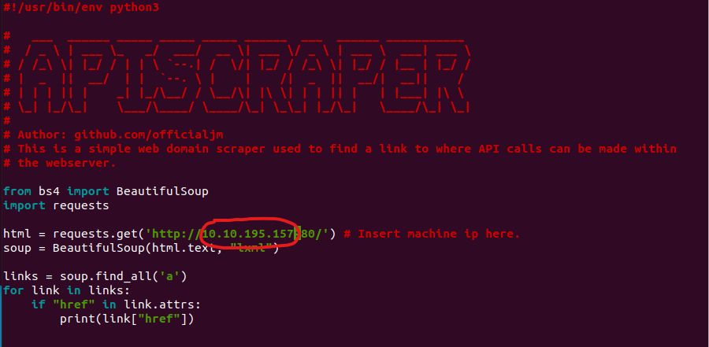
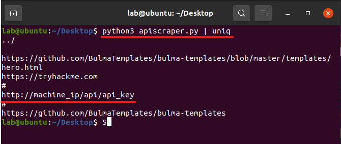
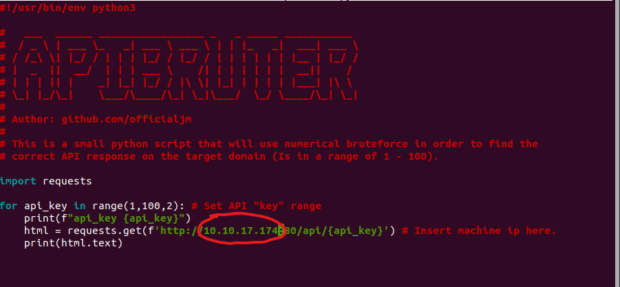
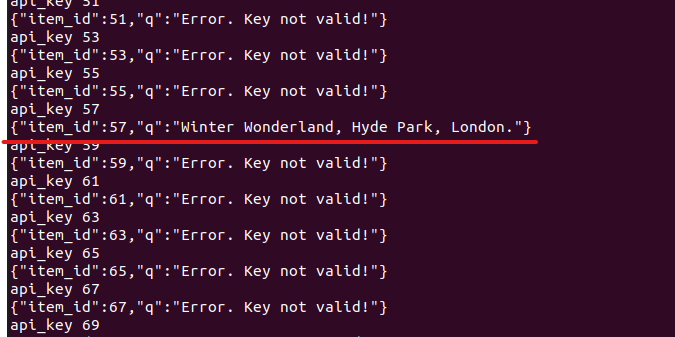

# <h1  align="center"> Avent of Cyber 2020 - Web URL & API Scraper </h1>

<h2 align="center">
<p>


</p>
</h2>

This is a colloction of 2 tools that I have made to help assist with the [TRYHACKME: Advent of Cyber 2020](https://tryhackme.com/christmas) CFT event. The following include a python3 based Web URL Scraper and a Web API Brute-force tool. Please feel free to make pull requests to improve project!

#

## Libraries

Make sure the following python libraries are installed:

- **Requests**
```
pip3 intall requests
```
- **Beautiful Soup**
```
pip3 install requests beautifulsoup4 
```
- **lxml** (For xml parsing)
```
pip3 install lxml 
```

Alternatively you can install `bpython` which will also serve as a python interpreter that we can use. You can see that we can also check if `bs4` is installed with no errors as we import the module:



## Usage
In order to utilize the API Bruteforce tool `APIBruter.py` , you will need to use the web-scraper `APIScraper` to find the URL that will take the API calls and give you the relevant information needed.
<br></br>

**APIScraper**

We download the `APIScraper` tool and make changes to inport the machine/web-server IP where **[MACHINE_IP]** is located: 



When running the script, be sure to pipe the `uniq` command to remove all duplicate URLs that may occur.

```
python3 APIScraper.py | uniq
```
This should output the URL needed in order to start bruteforcing the API key.


<br></br>

**APIBruter**

`APIBruter` is a simple python script made to find a valid API response from the web-server.  This is an odd number between 0-100. After too many attempts, the server will will block your IP (can be fixed with IP spoofing or changing IP).

We download the `APIBruter` tool and make changes to inport the machine/web-server IP where **[MACHINE_IP]** is located:



When running the script, just use the following:
```
python3 APIBruter.py
```
This script will try and import numbers **1 - 100** in order to get the vaild response, output result should look like this:



This reports both the results of the vaild response and the `item_id` number associated to make this API call.
